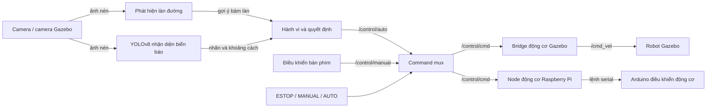

# Xe tự hành sử dụng ROS 2

Nguyên mẫu xe tự hành phân tán kết hợp **ROS 2**, **Gazebo**, **OpenCV**,
**YOLOv8** và **ONNX Runtime**. Hệ thống có khả năng bám làn, nhận diện biển báo,
thực thi hành vi lái và bảo vệ an toàn nhiều tầng trên laptop, Raspberry Pi và
Arduino.

> **Trạng thái dự án:** toàn bộ workspace trên laptop đã build thành công và bộ
> kiểm thử an toàn trọng tâm đã vượt qua. Trọng số mô hình được lưu bên ngoài Git
> và cần được cung cấp trước khi chạy perception. Dự án chưa công bố benchmark
> end-to-end.

## Điểm nổi bật

- Dùng chung pipeline từ perception đến điều khiển cho Gazebo và robot thật.
- Phát hiện vạch đường bằng OpenCV và duy trì bám làn khi chỉ thấy một bên vạch.
- Chạy mô hình nhận diện biển báo YOLOv8 tùy chỉnh bằng ONNX Runtime để inference
  ổn định trên CPU trong mô phỏng.
- Xử lý các biển STOP, giới hạn tốc độ, giảm tốc và rẽ bằng node hành vi có trạng
  thái.
- Xác nhận kết quả qua nhiều frame để hạn chế false positive đơn lẻ.
- Hỗ trợ ba chế độ `ESTOP`, `MANUAL` và `AUTO` thông qua command mux riêng.
- Dừng khi dữ liệu perception hoặc điều khiển quá hạn bằng các watchdog 300 ms
  độc lập.
- Giới hạn cả thời điểm bắt đầu và thời gian tối đa của quá trình tìm lại làn.
- Phân chia tính toán giữa laptop và Raspberry Pi qua ROS 2 DDS.

## Kiến trúc hệ thống



Laptop chạy perception, lập kế hoạch hành vi, hiển thị và phân xử lệnh điều
khiển. Raspberry Pi truyền ảnh camera và gửi lệnh động cơ đã được kiểm tra đến
Arduino. Trong mô phỏng, bridge động cơ chuyển đầu ra của mux thành lệnh vận tốc
Gazebo có giới hạn.

## Cấu trúc repository

```text
robot_system/
├── laptop_ws/src/
│   ├── DATN/                 # World Gazebo, URDF, launch và cấu hình mô phỏng
│   ├── perception_pkg/       # Nhận diện làn đường và biển báo
│   ├── decision_pkg/         # Hành vi, teleop, mux và simulation bridge
│   ├── interfaces_pkg/       # Message Control tùy chỉnh
│   ├── visualization_pkg/    # Hiển thị trạng thái khi chạy
│   └── bringup_pkg/          # Launch laptop cho robot thật
├── raspberry_ws/src/
│   ├── camera_pkg/           # Xuất bản ảnh camera
│   ├── control_pkg/          # Giao tiếp serial động cơ và watchdog
│   └── interfaces_pkg/       # Message Control dùng chung
├── requirements-laptop.txt
├── requirements-raspberry.txt
└── ENVIRONMENT.md
```

## Chạy nhanh mô phỏng

### 1. Cài đặt môi trường

Cấu hình đã kiểm tra gồm Ubuntu 22.04, ROS 2 Humble, Python 3.10 và Gazebo
Classic 11. Hướng dẫn đầy đủ cho máy tính và Raspberry Pi nằm trong
[ENVIRONMENT.md](ENVIRONMENT.md).

```bash
sudo apt update
sudo apt install -y \
  ros-humble-desktop \
  ros-humble-gazebo-ros-pkgs \
  ros-humble-image-transport-plugins \
  ros-humble-cv-bridge \
  python3-colcon-common-extensions \
  python3-rosdep \
  python3-venv

python3 -m venv --system-site-packages .venv
source .venv/bin/activate
python -m pip install -r requirements-laptop.txt
```

### 2. Cung cấp mô hình nhận diện

Các file mô hình được chủ động loại khỏi Git. Để chạy mô phỏng, đặt mô hình đã
export tại:

```text
laptop_ws/src/perception_pkg/perception_pkg/yolov8n.onnx
```

SHA-256 dự kiến:

```text
6bd6b0deb7671c10754cd7df8b85fb43689f9830435a2c7d8cc9353980b2b026
```

Kiểm tra file trước khi build:

```bash
sha256sum laptop_ws/src/perception_pkg/perception_pkg/yolov8n.onnx
```

Checksum, checkpoint PyTorch và lưu ý tương thích được mô tả tại phần
[mô hình production](ENVIRONMENT.md#production-models). Repository hiện chưa có
script tải công khai, vì vậy cần có quyền truy cập model artifact để triển khai
từ một bản clone mới.

### 3. Build và khởi chạy

```bash
source /opt/ros/humble/setup.bash
cd laptop_ws
rosdep install --from-paths src --ignore-src -r -y
colcon build --symlink-install
source install/setup.bash
ros2 launch DATN sim_full_launch.py
```

Chạy không có giao diện Gazebo và cửa sổ ảnh debug:

```bash
ros2 launch DATN sim_full_launch.py gui:=false show_debug:=false
```

Mô phỏng tương tác mặc định khởi động ở chế độ `AUTO`. Dùng
`initial_mode:=ESTOP` để kiểm tra quá trình kích hoạt thủ công:

```bash
ros2 launch DATN sim_full_launch.py initial_mode:=ESTOP
```

Các tham số như kích thước inference, confidence, vận tốc tối đa, watchdog và
tìm lại làn được tập trung trong
[`simulation.yaml`](laptop_ws/src/DATN/config/simulation.yaml).

## Thiết kế điều khiển và an toàn

Đường đi của lệnh điều khiển:

```text
/control/lane_suggest
  → /control/auto
  → command_mux
  → /control/cmd
  → motor_node hoặc sim_motor_bridge_node
```

Điều khiển bàn phím chỉ publish vào `/control/manual`. Command mux là node duy
nhất được thiết kế để publish `/control/cmd` và chỉ chọn một chế độ vận hành tại
mỗi thời điểm.

Khi chạy robot thật, mux khởi động trong `ESTOP`. Cần chủ động kích hoạt chế độ
tự hành:

```bash
ros2 topic pub --once /control/mode std_msgs/msg/String "{data: AUTO}"
```

Đưa hệ thống về trạng thái dừng phần mềm:

```bash
ros2 topic pub --once /control/mode std_msgs/msg/String "{data: ESTOP}"
```

Các tầng fail-safe:

| Tầng bảo vệ | Lỗi được phát hiện | Phản ứng |
|---|---|---|
| Decision node | Dữ liệu làn cũ quá 300 ms | Publish lệnh tốc độ bằng 0 |
| Command mux | Lệnh được chọn cũ quá 300 ms | Từ chối lệnh và publish dừng |
| Simulation bridge | `/control/cmd` cũ quá 300 ms | Publish `/cmd_vel` bằng 0 |
| Motor node trên Raspberry Pi | `/control/cmd` quá hạn | Gửi lệnh dừng |
| Hợp đồng firmware Arduino | Không có packet serial hợp lệ trong 500 ms | Đặt PWM động cơ bằng 0 |

Trong mô phỏng, quá trình tìm lại làn bắt đầu sau 10 frame không thấy làn và bị
dừng sau 30 frame nếu chưa tìm lại được. Các cơ chế dừng bằng phần mềm không thay
thế mạch emergency stop vật lý thường đóng.

## Các ROS interface chính

| Topic | Kiểu dữ liệu | Mục đích |
|---|---|---|
| `/raw_image/compressed` | `sensor_msgs/CompressedImage` | Ảnh đầu vào từ camera |
| `/perception/detected_label` | `std_msgs/String` | Nhãn biển báo/đèn đã xác nhận |
| `/perception/sign_distance` | `std_msgs/Float32` | Khoảng cách ước lượng đến biển |
| `/control/lane_suggest` | `interfaces_pkg/Control` | Gợi ý điều khiển bám làn |
| `/control/auto` | `interfaces_pkg/Control` | Đầu ra quyết định tự hành |
| `/control/manual` | `interfaces_pkg/Control` | Đầu ra điều khiển thủ công |
| `/control/cmd` | `interfaces_pkg/Control` | Lệnh động cơ đã qua mux |
| `/control/mode` | `std_msgs/String` | Yêu cầu chuyển chế độ |
| `/control/mux_status` | `std_msgs/String` | Chế độ hiện tại hoặc trạng thái timeout |
| `/diagnostics/decision` | `std_msgs/String` | Chẩn đoán trạng thái hành vi |
| `/diagnostics/sim_motor` | `std_msgs/String` | Chẩn đoán simulation bridge |

## Kiểm thử

Quá trình kiểm tra build thành công cho cả sáu package trong laptop workspace.
Chạy bộ kiểm thử hồi quy cho an toàn và cấu hình mô phỏng bằng:

```bash
source /opt/ros/humble/setup.bash
source laptop_ws/install/setup.bash
python3 -m pytest -q \
  laptop_ws/src/decision_pkg/test/test_control_safety.py \
  laptop_ws/src/DATN/test/test_simulation_configuration.py
```

Bộ kiểm thử trọng tâm hiện có tám test đều vượt qua, bao gồm:

- `ESTOP` không bao giờ chuyển tiếp lệnh;
- lệnh cũ hoặc bị thiếu luôn bị từ chối;
- chỉ lệnh mới của chế độ đang chọn được chuyển tiếp;
- vận tốc và góc lái mô phỏng luôn nằm trong giới hạn;
- simulation bridge nhận đầu ra từ mux, không đi tắt qua mux;
- timeout an toàn và quá trình tìm lại làn có giới hạn được cấu hình đúng.

Đây là unit test và static regression test, chưa thay thế được kiểm thử scenario
trong Gazebo. Việc sửa lint cho toàn workspace và đánh giá mô phỏng end-to-end
tự động vẫn đang được thực hiện.

## Kiểm tra chèn lỗi bắt buộc

Trước khi chạy robot thật, cần xác nhận toàn bộ trường hợp sau:

- Ngắt camera: `/control/auto` và `/control/cmd` phải về tốc độ 0.
- Dừng decision node hoặc ngắt Wi-Fi: watchdog của mux/motor phải dừng xe.
- Ngắt serial: watchdog Arduino phải đưa PWM về 0.
- Kết nối lại serial: xe vẫn đứng yên cho đến khi nhận được lệnh mới.
- Giữ biển STOP trước camera: biển chỉ kích hoạt một lần và chỉ được kích hoạt
  lại sau khi biến mất.
- Hiển thị đèn đỏ: xe phải dừng cho đến khi đèn xanh được xác nhận.

## Giới hạn hiện tại và hướng phát triển

- Model artifact được lưu bên ngoài repository và chưa có script tải tự động.
- Gazebo world hiện có biển báo nhưng chưa có đèn giao thông.
- Nhận diện làn dùng threshold và contour của OpenCV, được tinh chỉnh cho góc
  camera và hình dạng đường hiện tại.
- Repository chưa công bố độ chính xác detector, inference latency, sai số bám
  làn hoặc tỷ lệ hoàn thành qua nhiều lượt chạy.
- Các scenario Gazebo end-to-end hiện vẫn được kiểm tra thủ công.
- Dự án sử dụng Gazebo Classic 11 để phù hợp với ROS 2 Humble.

Các kết quả dự kiến bổ sung cho portfolio gồm precision/recall và mAP của
detector, ONNX latency, sai số tâm làn, tỷ lệ hoàn thành mô phỏng qua nhiều lượt
và thời gian từ khi xảy ra lỗi đến khi xe dừng.

## Công nghệ sử dụng

ROS 2 Humble · Python · Gazebo Classic · OpenCV · YOLOv8 · ONNX Runtime ·
PyTorch · NumPy · Raspberry Pi · Arduino · Serial · DDS
